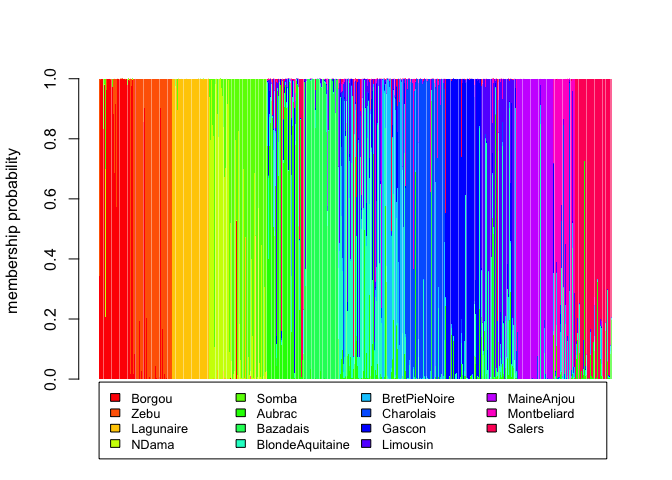
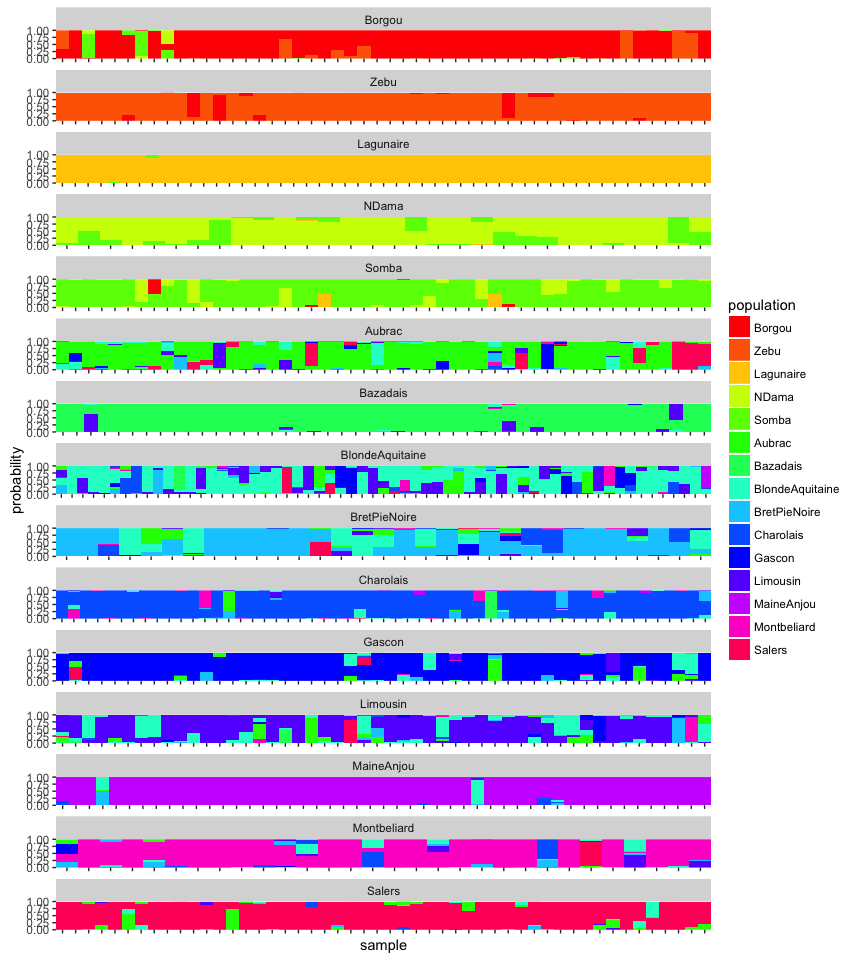
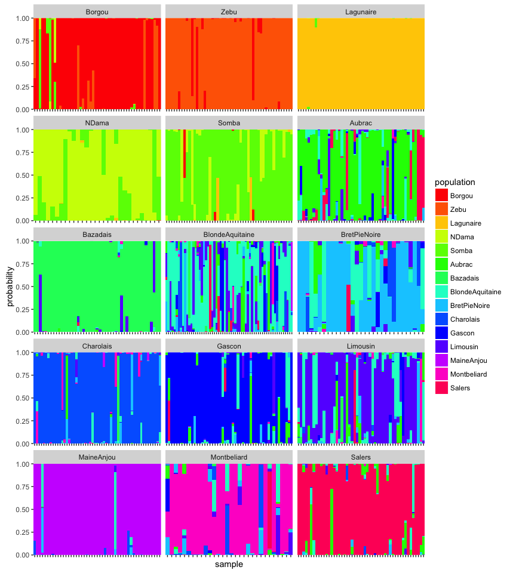
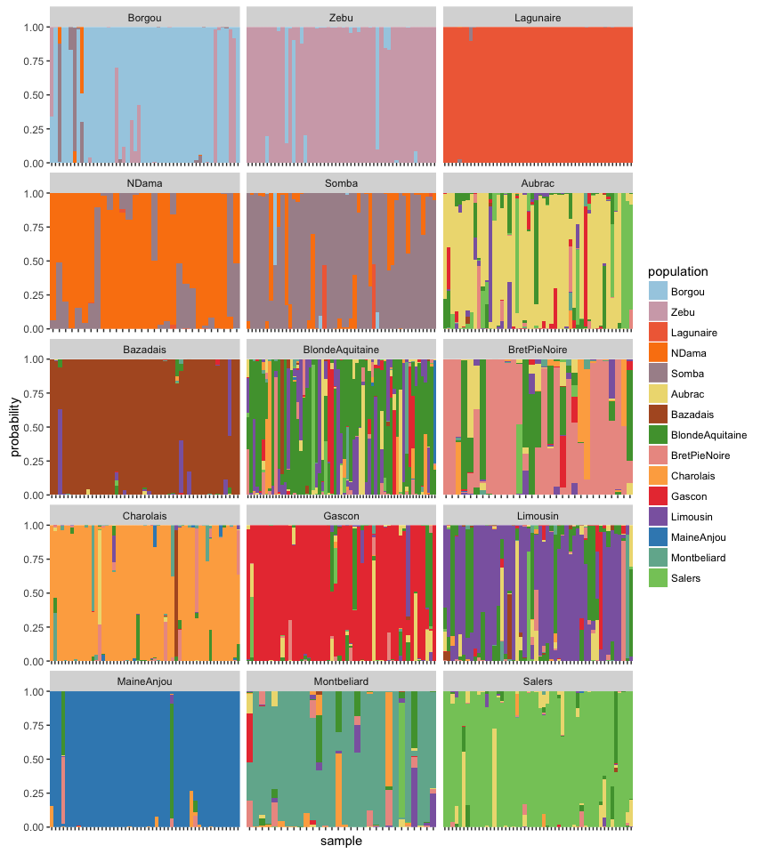
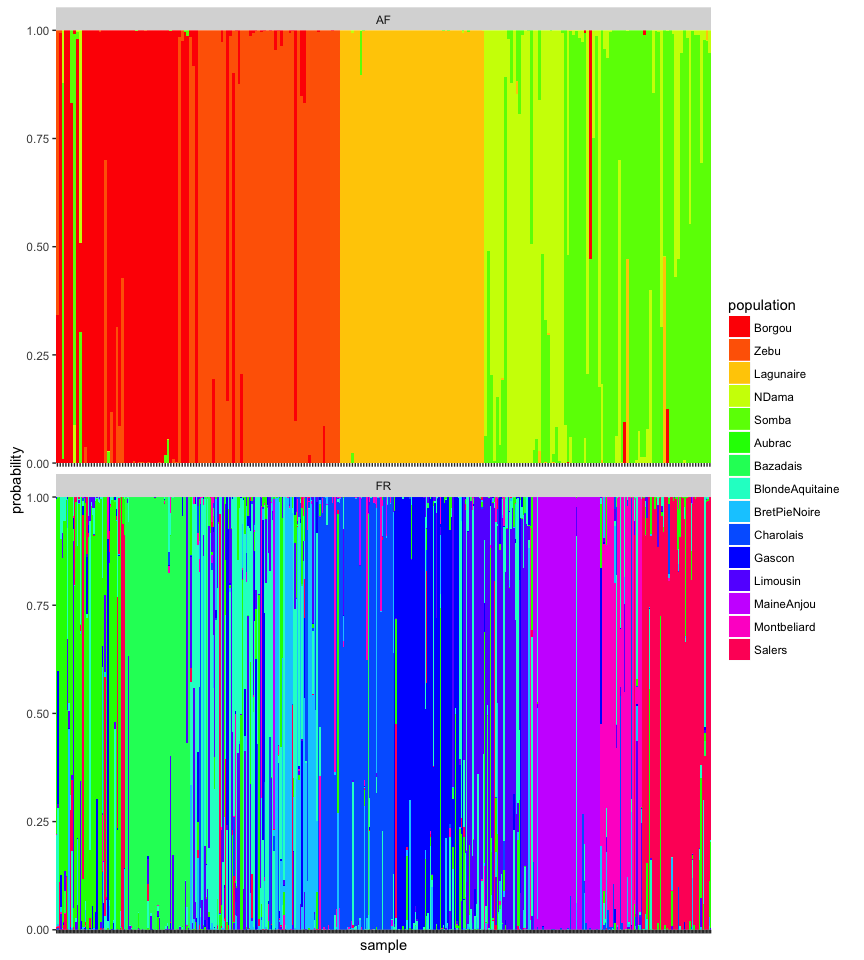

<!-- README.md is generated from README.Rmd. Please edit that file -->
ggcompoplot
===========

The goal of ggcompoplot is to create compoplots that can be manipulated using the grammar of graphics. This code originally appeared in <https://zenodo.org/record/13007>.

Installation
------------

To install, download devtools, and copy and past this into your R console:

``` r
devtools::install_github("zkamvar/ggcompoplot")
```

Example
-------

### Compoplot from DAPC Analysis (from adegenet)

``` r
library('adegenet')
library('ggcompoplot')
library('ggplot2')

data(microbov)
strata(microbov) <- data.frame(other(microbov))

dapc1 <- dapc(microbov, n.pca=20, n.da=15)

compoplot(dapc1, lab="") # Adegenet compoplot
```



### Using ggcompoplot

To use ggcompoplot, all you need is the results of your DAPC analysis and your genind/genlight object:

``` r
# Setting a named palette of colors
(rainbov <- setNames(rainbow(nPop(microbov)), popNames(microbov)))
#>          Borgou            Zebu       Lagunaire           NDama 
#>     "#FF0000FF"     "#FF6600FF"     "#FFCC00FF"     "#CCFF00FF" 
#>           Somba          Aubrac        Bazadais BlondeAquitaine 
#>     "#66FF00FF"     "#00FF00FF"     "#00FF66FF"     "#00FFCCFF" 
#>    BretPieNoire       Charolais          Gascon        Limousin 
#>     "#00CCFFFF"     "#0066FFFF"     "#0000FFFF"     "#6600FFFF" 
#>      MaineAnjou     Montbeliard          Salers 
#>     "#CC00FFFF"     "#FF00CCFF"     "#FF0066FF"

ggcompoplot(dapc1, microbov, pal = rainbov) + theme(axis.text.x = element_blank())
```



``` r

# 3 columns
ggcompoplot(dapc1, microbov, cols = 3, pal = rainbov) + theme(axis.text.x = element_blank())
```



``` r

# Different color palette
ggcompoplot(dapc1, microbov, cols = 3, pal = funky) + theme(axis.text.x = element_blank())
```



``` r

# Per Country
setPop(microbov) <- ~coun
ggcompoplot(dapc1, microbov, pal = rainbov) + theme(axis.text.x = element_blank())
```


